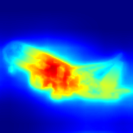
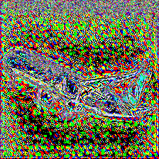

# Sight

## Overview

Sight is a project designed to help determine the features which were used by the model \
to determine the clasiication process.It mainly focuses on higlighting the features which were\
used by the model most.This project is for educational puposes ,implments a gui for the captum and  uses the ResNet150 model. 


- **Interactive Map Visualization:**  
    Explore detailed map views with the interactive illustration below.  
        
        
        

## Installation

1. Clone the repository:
    ```
    git clone https://github.com/RishabhGarg1808/Sight.git
    ```
2. Navigate to the project directory:
    ```
    cd Sight
    ```
3. Install dependencies:
    ```
    pip install -r requirements.txt
    ```
    install the captum which supports MultiScaleFastcam
    ```
    git clone https://github.com/RishabhGarg1808/captum-develop.git
    cd captum-develop
    pip install -e .
    ```

## Usage

To run the project, execute:

```
python3 main.py
```

#### References:
[captum](https://github.com/pytorch/captum)